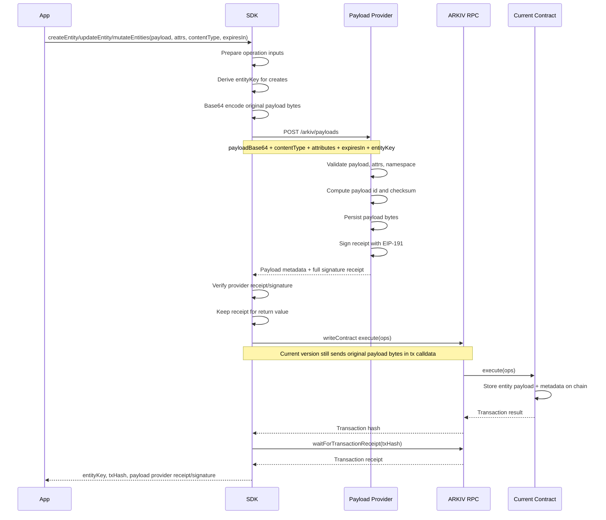

# Payload Provider Transaction Flow

This document describes the first SDK integration with the Atlas Payload Provider.
The current ARKIV contract remains unchanged in this version.

## Goal

Before the SDK sends a create or update transaction to the ARKIV RPC, it can submit
the entity payload bytes to a payload-provider service. The provider stores the
payload, returns metadata, and optionally returns an EIP-191 signature proving that
it received the exact payload.

The transaction still sends the original payload bytes inline to the current
contract. Provider data is additive and is returned to the caller.

## First Version Flow



## Data Movement

Conceptually, the same original payload bytes take two paths:

```text
Original payload bytes
   |
   |--> Payload Provider: stored bytes + signed receipt
   |
   |--> Current Contract: inline payload bytes, unchanged behavior
```

The provider path gives applications an external availability record immediately.
The contract path keeps existing RPC, query, and read behavior intact.

## Provider Submission

The SDK uses the ARKIV-aware provider endpoint:

```http
POST /arkiv/payloads
Content-Type: application/json
Authorization: Bearer <optional token>
```

The request includes:

- `namespace`, defaulting to `arkiv.entities`.
- `payloadBase64`, generated from the original `Uint8Array`.
- `contentType`.
- `attributes`.
- `expiresIn`.
- `entityKey`, derived for creates and supplied for updates.
- `nonce`, generated by the SDK for reference-mode transactions.
- `payment`, currently the SDK constant `100000`.

The response includes:

- normalized ARKIV context,
- provider payload metadata,
- and, when signing is enabled, the full EIP-191 receipt signature.

## Return Values

When payload-provider mode is enabled, wallet actions return their normal
transaction data plus provider receipt data.

```ts
const result = await client.createEntity(...)

result.entityKey
result.txHash
result.payloadReceipt
```

For batched mutations:

```ts
const result = await client.mutateEntities(...)

result.txHash
result.createdEntities
result.updatedEntities
result.payloadReceipts
```

Each provider receipt is associated with a create or update operation and contains
the entity key, provider URL, normalized ARKIV context, payload metadata,
reference nonce/payment, optional reference JSON, and signature verification
result.

## Reference Transaction Payload

When `payloadProvider.transactionPayload` is `reference` (the default when a
provider is configured), the lower branch changes from inline payload bytes to a
provider reference:

```text
Original payload bytes
   |
   |--> Payload Provider: stored bytes + signed receipt
   |
   |--> Arkiv precompile: provider reference + signature data
```

The first reference format includes the full signature, signed nonce, and numeric
payment. Later versions can optimize it into a smaller payload id, checksum,
message hash, and compact signature format.
