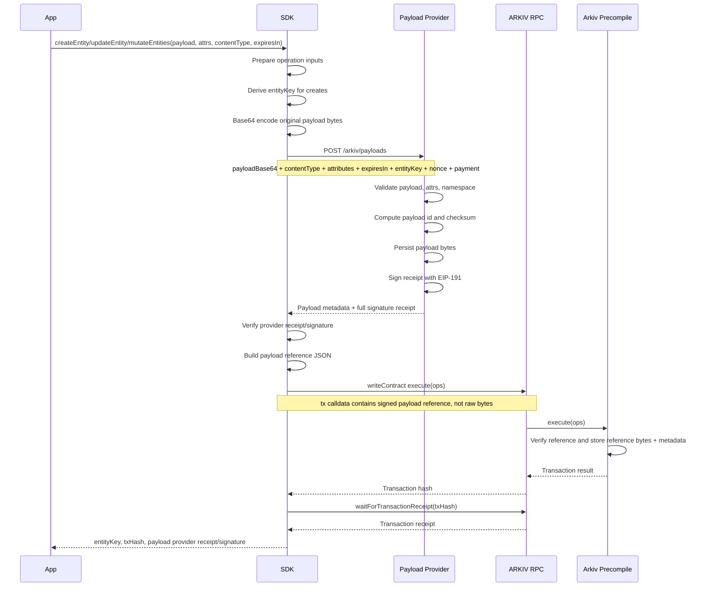

# Payload Provider Transaction Flow

This document describes the SDK integration with the Atlas Payload Provider.

## Goal

Before the SDK sends a create or update transaction to the ARKIV RPC, it submits
the entity payload bytes to a payload-provider service. The provider stores the
payload, returns metadata, and returns an EIP-191 signature proving that it
received the exact payload.

The transaction sends a signed payload reference to the Arkiv precompile. Inline
create/update payloads are no longer supported.

## First Version Flow



## Data Movement

Conceptually, the original payload bytes leave Arkiv RPC traffic:

```text
Original payload bytes
   |
   |--> Payload Provider: stored bytes + signed receipt
   |
   |--> Arkiv precompile: signed reference JSON only
```

The provider path is the content delivery path. The Arkiv path stores and proves
the reference.

## Provider Submission

The SDK uses the ARKIV-aware provider endpoint:

```http
POST /arkiv/payloads
Content-Type: application/json
Authorization: Bearer <optional token>
```

The request includes:

- `namespace`, defaulting to `arkiv.entities`.
- `payloadBase64`, generated from the original `Uint8Array`.
- `contentType`.
- `attributes`.
- `expiresIn`.
- `entityKey`, derived for creates and supplied for updates.
- `nonce`, generated by the SDK for reference-mode transactions.
- `payment`, currently the SDK constant `100000`.

The response includes:

- normalized ARKIV context,
- provider payload metadata,
- the full EIP-191 receipt signature.

## Return Values

Wallet actions return their normal transaction data plus provider receipt data.

```ts
const result = await client.createEntity(...)

result.entityKey
result.txHash
result.payloadReceipt
```

For batched mutations:

```ts
const result = await client.mutateEntities(...)

result.txHash
result.createdEntities
result.updatedEntities
result.payloadReceipts
```

Each provider receipt is associated with a create or update operation and contains
the entity key, provider URL, normalized ARKIV context, payload metadata,
reference nonce/payment, optional reference JSON, and signature verification
result.

## Reference Transaction Payload

Create/update transactions always send a provider reference:

```text
Original payload bytes
   |
   |--> Payload Provider: stored bytes + signed receipt
   |
   |--> Arkiv precompile: provider reference + signature data
```

The first reference format includes the full signature, signed nonce, and numeric
payment. Later versions can optimize it into a smaller payload id, checksum,
message hash, and compact signature format.

## Reading Payloads

`arkiv_query` returns metadata and a lightweight `payloadRef`, not raw payload
bytes. Applications that need bytes call the payload provider directly:

```http
GET /payloads/{id}/raw
```

The SDK can do this automatically when asked with `hydratePayloads: true` or
`QueryBuilder.withPayload()`. Hydration uses at most five concurrent downloads by
default and verifies checksum/id before attaching bytes to `Entity.payload`.
